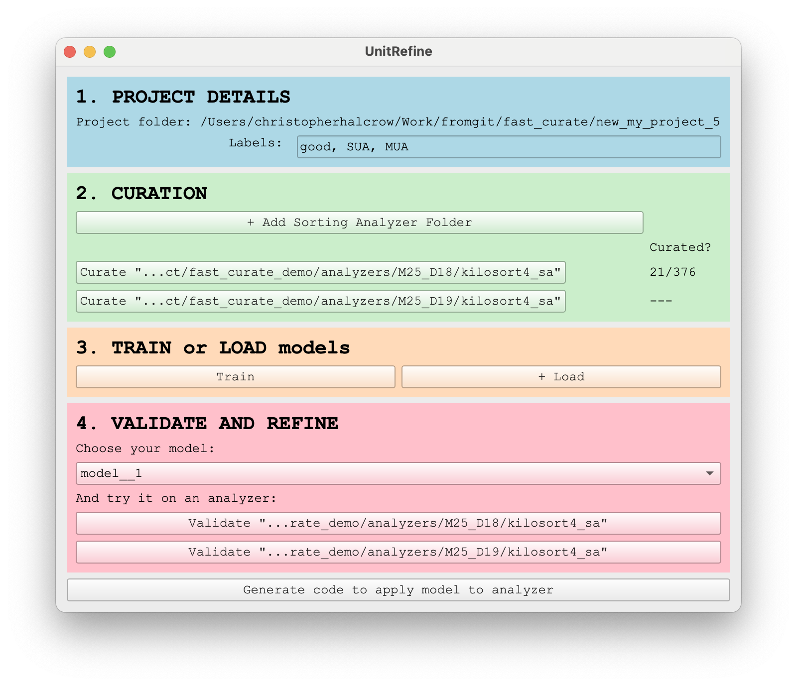

# UnitRefine

Automated curation for spike sorted units. 

The paper: 

You can use UnitRefine to manually label sorted units (using SpikeInterface-GUI as a backend), then train a model based on this labelled to curate for you! If you already have a model, you can use UnitRefine to validate that it does what you expect.

You'll need a SortingAnalyzer from SpikeInterface to use it.

## Installation

Install `uv`, the modern python package manager.

1. Clone this repository and move into the repo folder

``` bash
git clone https://github.com/chrishalcrow/unit_refine.git
cd unit_refine
```

2. Open unit_refine, creating a new project

``` bash
uv run unit_refine --project_folder my_new_project
```

Note: you must be in the unit_refine folder that you've cloned from github when you run this command.

A window should pop up that looks something like this:



From here, it should be easy to add sorting analyzers, curate the data, train a model and validate your model. Keep an eye on the feedback that comes through the terminal - it will help! You can also generate code which you could use in a Python script.

## Thanks

UnitRefine is highly dependent on the flexible and powerful SpikeInterface and Spikeinterface-GUI packages. Many thanks to Alessio, Sam, Zack, Joe who gave help and feedback to this project, and to the entire SpikeInterface team <3
